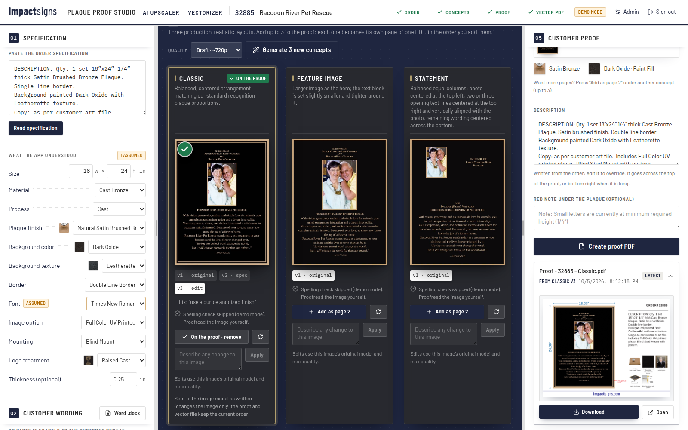

# Plaque Proof Studio

Impact Signs' internal tool for cast bronze plaques. It takes an order and produces:

1. **Two concept images (Classic and Statement)** of the finished plaque, generated with OpenAI's image model (`gpt-image-2.5-sunburst`). The previous middle option, Feature Image, is no longer generated; existing versions and files are kept.
2. **The customer proof PDF**: the Description sheet, measured from real proofs (the Standard and Order/version templates are kept in the code for the measured samples and tests only):
   - **Standard** (Liquid Mercury): red dimension brackets, mounting diagram, finish and paint-fill swatches, disclaimer.
   - **Description sheet** (Awe, Raccoon River): the plaque with its blue dimensions on the left, the full page height; ORDER#/VERSION and the DESCRIPTION top right; captioned option tiles bottom right. (The real proofs also have a Visual Scale panel, a 6 ft person or a photo of the site; the app no longer makes it.)
   - **Order version + outline art** (Structure of Merit): an "ORDER # – VERSION" header, side view and process captions, plus a second page with the production outline art.
3. **The vector production PDF**, built like `production_32241.ai`: plaque-size page, one ink (black = raised metal, white = recessed field), all text as outlines, no images, and an empty placeholder window for the photo.



The interface uses the current impactsigns.com palette: navy navigation and buttons, blue links, charcoal text, gold selection accents and light neutral backgrounds, with Barlow for text and IBM Plex Mono for numbers. Cards sit on a faint drafting grid with soft navy-tinted shadows, lists and panels ease into place, and a thin navy bar sweeps across a panel while it works (it all switches off when the system asks for reduced motion). Customer proof and production PDF colors stay locked to the measured originals.

---

## How a designer uses it

1. **Sign in** with your username and password. Each person sees only their own jobs, versions, proofs and upscales.
2. **New plaque job:** enter the job number and a short name. To remove a job you no longer need, click the trash icon on its row in the Jobs list (this also removes its concepts, proofs and production files).
3. **01 Specification:** paste the order spec exactly as written and click **Read specification**. The app fills in a spec sheet from the catalog. Anything the order didn't state gets an amber **Assumed** tag; check those and change any dropdown if needed.
4. **02 Customer wording:** upload the customer's Word .docx or paste the text. The text is kept character for character. Each line gets a role (headline, subhead, body, footer), which you can change. Under each line, small buttons set:
   - **I / B / Sc**: italic, bold, small capitals.
   - **A− / A+**: size.
   - **Columns**: for donor lists.
   - **Rule**: a raised line under a heading.
   - **Font**: a different font for that line only.

   When there is a photo, a **Photo goes here** marker sets its position; use ↑ / ↓ to move it between lines. With several photos they move together.
5. **03 Customer files:** add photos, logos, sketches or a complete **Exact design**. Pick files with **Add**, or drop them onto the appropriate box.
   - **Photos** (up to 4) sit side by side, each in its own raised frame, left to right in the order listed (four may go in two rows of two). Two landscape photos on a landscape plaque stack at the left.
   - **Logos** (up to 6) sit together in one row, left to right in the order listed (from four logos, two rows when that makes them clearly larger). **Logo position** (top, middle, bottom) moves the whole row.
   - **Sketches** (up to 4) only guide the image model; they are never drawn on the plaque.
   - **Exact design** (one per job) is the customer's complete approved artwork: PDF/AI, SVG, PNG or JPG. It preserves the supplied composition, handwriting, custom lettering, doodles and painted details while applying the ordered plaque material and finish. PDF/AI uses page 1; SVG lettering must be converted to outlines so the server cannot substitute a font. Both concept options use the same artwork. Separate wording, photos, logos and sketches stay on the job but do not replace or add to this design. You can generate without a separate wording list or photo. **View design** opens the reference, and **Download original** returns the untouched customer file. Remove the design to replace it; earlier versions keep their own original.
   - Use **‹ / ›** to change the order and the trash icon to remove one file. Removing a file does not delete it from older versions: **Use this one** on an older version brings its files back.
   - The same file added twice, a file that is not a picture, or one file too many is refused with its name; the other files are still added.
   - The app warns about each photo that is low resolution for its size on the plaque.
6. **04 Concepts:** click **Generate 2 concepts**. Images always use Max rendering quality at 1.5K (1536 px longest edge, with proportions preserved and dimensions rounded for the API). There is no quality selector or 4K mode. Images stream in as they render (about a minute). On landscape plaques with a photo, Classic puts the photos on the left and all wording on the right. Statement always uses equal-width top columns: photos centered on the left, up to three opening lines centered on the right and aligned vertically with the photos, and the rest of the wording across the bottom, on both portrait and landscape plaques. Under each image you can:
   - **Use this one** to put it on the proof: the concept stands forward with a green check and the right-hand panel shows it as page 1. Under another concept press **Add as page 2** (and **page 3**): up to three images go on one proof, each as its own page of the same PDF. Press the button again (**On the proof · remove**) or the × in the right-hand panel to take one off, and use the arrows there to change the page order. The vector file is made from page 1. Every file in the right-hand panel says which concept it came from (*From Statement v2*).
   - **The full-size view** (click a picture): scroll to zoom, drag to move, double-click to fit, +/−/0/1 keys, Esc to close.
   - **Regenerate** (↻) the same layout for a fresh take.
   - **Fix** with any instruction at all, small or large, and several changes at once if you like. Enter applies; Shift+Enter adds a line. The app shows how it read the request, and the result is saved as a new version (v2, v3…). Nothing is refused: whatever the catalog, the wording editor and the layout cannot express is sent to the image model word for word as an image-only change (the proof and vector file then keep the current order, and the note under the box says so). Fix always edits the selected image using its saved image model at Max quality and 1.5K resolution, including older images created at another quality. Catalog changes also edit that picture rather than starting over. Your exact instruction goes directly into the edit prompt; the planner’s summary does not replace it. Small changes stay small, and unmentioned details are preserved. Appearance edits use the selected photograph without a competing layout drawing. Order and spacing changes also receive an updated drawing so the proof and vector file follow them. Original logo artwork is included for requested logo repairs. Your explicit instruction overrides conflicting rules for the requested change; everything else stays protected. The result is still spell-checked against the order, and the proof asks before it uses a picture whose wording differs.
     - **Layout** changes (text size, spacing, photo or logo size, moving the content up or down, photo above or below the text, logo position) change that column's layout drawing, so the proof and the vector production file follow them. Each column keeps its own adjustments. With several photos or logos, "make the logos bigger" resizes the group together. Move an individual logo with its Position control or a request such as "move logo 2 to the right". Resizing just one logo remains an image-only change.
     - Adding, removing or swapping photos and logos is done in **03 Customer files**, not with Fix.
     - **Catalog** options and **exact wording** changes update the order, as before.
     - **Anything else** about how the image looks (etching depth, photo detail, finish appearance, moving one element in a way the layout can't) is made by the image model on the current picture. These change the image only; the vector file keeps the layout drawing.
     - **Undo order change** reverses any layout, catalog or wording change.
     - Editing an older version works from that version's own content, even if the order has moved on since.

   Both concepts preserve the complete supplied logo artwork, including taglines and small text underneath its symbol; this lettering is separate from the customer wording list.

   **Impact Signs design guidance:** each new concept uses up to three relevant examples from the reviewed General Purpose Examples collection, along with guidance on hierarchy, restraint, metal finish, texture and image treatment. The app matches the examples to the order locally, so it does not analyze the whole collection again or generate extra candidates on every click. Open **Guided by 3 Impact Signs examples** under a concept to see which work informed it. Example names, people, logos and ornaments never become part of the customer order. Classic and Statement keep their shared layout drawings, so the proof and vector still follow the same geometry.

   **Design review:** the same call that checks spelling also reviews the image against its drawing, specification and relevant examples. It checks layout, materials, treatment, readability and workmanship. Specific issues appear under the concept and before making a proof. Fix the image or acknowledge that you inspected it yourself. A missing or incomplete live review also needs inspection; demo mode clearly says the review was skipped. This is a visual screening step, not a guarantee of quality or foundry approval.

   Every image is automatically **spell-checked**: the app reads the text back and compares it with the customer's wording.

   Exact design wording is checked against the uploaded artwork. Its review also compares letterforms, marks, placement and colored accents against the source. Fix compares its result against the selected original photograph to look for unintended changes, and automatic edge cropping is disabled for edits and exact designs. AI can still alter fine details, and the review can miss them: inspect both images before sending a proof. Exact design edits to embedded lettering need your own proofreading. The proof description identifies the customer artwork instead of claiming a stock font. Use **Download original** for the production handoff: automatic vector PDF creation is disabled for exact designs because it cannot faithfully reproduce their custom lettering, colors or free-form image edits.
7. **05 Customer proof:** the description is written from the order; edit it if needed (it goes top right, under ORDER#, and steps down in size if it is long). Optionally add a red note under the plaque. Then click **Create proof PDF** (with several images it reads **Create 3-page proof PDF**: page 1 is the first image, page 2 the second, and so on; the file card has a Page 1 / 2 / 3 switch for the preview). If the spell check found a difference, the app stops and shows it: fix the image first, or confirm you've checked it. Each layout counts its own versions: the first Classic, Feature Image and Statement proofs are all version 1 (`Proof - 32241 - Classic.pdf`, `Proof - 32241 - Statement.pdf`), and the next Classic proof is `Proof - 32241 - Classic v2.pdf`. A multi-page proof is named after its pages (`Proof - 32241 - Classic + Statement.pdf`) and each page counts its own layout's versions. The proof is always the Description sheet: order description, the plaque with blue dimension arrows down the left side, captioned option tiles bottom right. (There is no visual-scale figure and no choice of proof style any more.)
8. **06 Vector production PDF:** click **Create vector PDF** for the concept on the proof. The file name ends in the layout, e.g. `32241_Heritage_Foundation_12x18_Statement_production.pdf`. Letters are kept at least ¼" tall: lines that would be smaller are enlarged to ¼" in the layout (so the image, the proof and the vector file agree), and the preflight says which. Digits and punctuation have no minimum. If the wording cannot fit the plaque at ¼" (a long donor list on a small plate), the letters are made smaller until everything fits, instead of running off the plaque: the layout says so, and the preflight's *Letter heights* line shows the smallest size, so you can choose a larger plaque or shorter wording. Donor lists with gift levels ("$15,000+", "$7,500-$14,999", or GOLD, SILVER) are set in columns that keep each level together with its names. A preflight checklist confirms page size, no fonts, no images and one ink, and warns about stand-in fonts, traced logos and minimum letter heights. Download it and open it in Illustrator (it opens directly, like the .ai files).

Nothing is ever overwritten: every image, proof and production file is kept as its own version.

**Logos** are made one of two ways; pick it under **Logo treatment** in the specification (the order's wording "UV print logo" sets it):
- **Raised Cast:** the logo's lines and shapes are cast as raised metal, like the letters. The vector file carries the logo traced to outlines.
- **UV Print:** the complete logo is printed in black, white and gray on a smooth raised metal plate.
- **UV Print Color:** the complete logo is printed in its original colors, including white lettering and fine white lines. Existing color UV jobs keep their color treatment.

Both print options put only the raised plate in the one-ink production PDF; the artwork is printed after casting. Opaque white stays white, and transparent areas show the metal. Each uploaded logo has its own **Position** control: Automatic, Top, Bottom, Left or Right. Logos on the same side follow their upload order. Automatic keeps the existing order placement. If space is tight, logos shrink to preserve readable lettering; the layout reports when the wording still cannot fit.

The concept image, the layout drawing, the proof description and the vector file all follow the choice. The logo reader works from any file: a clean logo on white, a gold logo on a dark background, a full-color logo, or a photo of a finished plaque (the marks on the plate are read as the logo).

**The workspace fits the work.** Drag the handles between the three sections to resize them (all three stay on screen); double-click a handle to let the layout follow your work again: the order sheet has the room first, then the concepts, then the proof panel opens up once a concept is on it.

### AI Upscaler

The **AI Upscaler** tab, next to **Plaque Proof Studio** at the top, enlarges a low-resolution image just enough to be usable, without changing it. It is separate from jobs.

The **Vectorizer** tab turns a picture or PDF (PNG, JPG, WebP, TIFF, SVG, PDF, PDF-compatible .ai) into a one-ink vector PDF (and an SVG): outlines only, no pixels, no fonts. It uses the same logo reader as the production file, so a photo of a finished plaque comes out as its logo. Pictures use automatic background detection; PDF and SVG pages are treated as white (dark marks on a light page). PDF/.ai uses page 1. The interface uses an 8.5-inch width and the finest outline setting; the height follows the cropped artwork. It is separate from jobs. Check traced edges against the source, especially for low-resolution photos or fine lettering; tracing cannot recover detail missing from the original. Outline SVG text before uploading when its exact font matters.

If an uploaded raised-cast logo has no traceable marks, creating the production PDF stops and asks for a clearer logo, instead of silently leaving it out.

The **Proof Merger** tab joins up to 15 proof PDFs into one PDF. Add the files (drop them or click), look at the preview card of each, put them in the order you want by dragging a card or using its arrows, then press "Merge into one PDF". Page 1 of the result is the first card, and every page of every file is kept. Nothing is saved on the server.

1. Drop in or choose an image (PNG, JPG, WebP, TIFF or GIF, up to 30 MB).
2. Pick **720p** or **1080p**. The short side becomes 720 or 1080 px and the proportions stay the same. Pick the smallest size that works: the less the image is enlarged, the less the AI has to fill in. Images that are already that size are refused, at no cost.
3. Click **Upscale image** (about 30 to 90 seconds). The original and the upscale appear side by side with a **% match** score. The score comes from shrinking the upscale back to the original size and comparing them.
4. Download the **upscaled PNG**, or the **standard upscale (no AI)**: a plain enlargement with nothing added. Use the standard one if the match warning says the AI changed something.

How it stays faithful: the image model (`OPENAI_IMAGE_MODEL`, the same one used for concepts) gets a Lanczos enlargement of the original, high input fidelity, and a prompt that forbids any change. If the result still lines up with the original, the original's broad tones and colors are locked back in, so only fine detail comes from the AI. Transparent images keep their own transparency. Upscales count toward `DAILY_BUDGET_USD`, are listed under **Recent upscales**, and can be deleted there.

### Launch film

A 100-second marketing video of the app lives in [`marketing/launch-video/`](marketing/launch-video/): the finished MP4s are in its `out/` folder, and its README explains how to change and re-render it.

---

## Getting it online on Render.com (one time, about 10 minutes)

Do these once. Afterwards changes pushed to the branch redeploy only after the automated checks pass.

**Before you start: OpenAI account (5 minutes)**
1. Go to [platform.openai.com](https://platform.openai.com) → **API keys** → **Create new secret key**. Copy it somewhere safe. Also **revoke the old key** that was pasted in chat.
2. **Billing** → add at least $10 of credit. Image generation does not work on an account with no credit.
3. **Settings → Organization → General → Verify Organization.** OpenAI requires a verified organization before its image models can be used. It takes a few minutes with an ID check.

**Deploy**
1. Click **[Deploy to Render](https://render.com/deploy?repo=https://github.com/tmoosabhoy6/Impact-Signs-Designer/tree/claude/blissful-mccarthy-63trmd)** and sign in to Render with GitHub. If Render asks, allow it to access the `Impact-Signs-Designer` repository; it is private, so Render needs permission to read it.
   - *Or manually:* Render dashboard → **New** → **Blueprint** → choose `Impact-Signs-Designer` → set the branch to **`claude/blissful-mccarthy-63trmd`**.
2. Render reads `render.yaml` and shows one web service (`plaque-proof-studio`, Starter plan) with a 5 GB disk. It asks for these values:
   - `OPENAI_API_KEY`: the new key from step 1.
   - `SUPABASE_URL` and `SUPABASE_PUBLISHABLE_KEY`: from Supabase → your project → **Project Settings → API Keys** (see **Sign-in accounts** below).
   - `APP_PASSWORD`: leave empty when the Supabase values are set.
3. Click **Apply** (or **Deploy Blueprint**). The first build takes about 5 minutes. When it says **Live**, open the address shown at the top, e.g. `https://plaque-proof-studio.onrender.com`.
4. Sign in, go to **Admin → System** and click **Run a test image**. One small image should appear within about a minute. If something is wrong, the message says exactly what (key, credit, organization verification…).

The Starter plan plus the 5 GB disk costs about $7–9/month. Jobs, images and PDFs are kept between updates.

**No webhook is needed.** The app calls OpenAI and receives each image in the same request, streaming progress to the screen.

### Sign-in accounts

Accounts (username + password) live in a Supabase project, in the `app_users` table created by [`supabase/migrations/`](supabase/migrations/). Passwords are stored only as bcrypt hashes. The table cannot be read with the publishable key. The app server checks a sign-in through the `app_login` database function, and ten wrong passwords in a row lock that account for 15 minutes.

- **Add a person or change a password:** Supabase → **SQL Editor** → run `select public.app_set_user('Name', 'their-password');`. Usernames are not case-sensitive.
- **Remove a person:** `delete from public.app_users where lower(username) = 'name';`
- Each job and upscale belongs to the account that made it; other accounts cannot list, open, download or delete it. Jobs made before accounts existed belong to `LEGACY_JOBS_OWNER` (default `taher`).
- Use passwords longer than 4 digits where you can: the lock-out slows guessing but a short PIN is still easy to guess over days.

---

## Settings (Render → your service → Environment)

| Setting | Default | What it does |
|---|---|---|
| `OPENAI_API_KEY` | (none) | OpenAI key. Required for real images. |
| `SUPABASE_URL` | (none) | Supabase project with the sign-in accounts, e.g. `https://<ref>.supabase.co`. |
| `SUPABASE_PUBLISHABLE_KEY` | (none) | That project's publishable key (`sb_publishable_…`; the legacy anon key also works). Used only by the server. |
| `LEGACY_JOBS_OWNER` | `taher` | Username that owns jobs and upscales made before sign-in accounts existed. |
| `APP_PASSWORD` | (none) | Older setup without Supabase: one shared team password plus each person's name. In production, with neither set, nobody can sign in. |
| `SESSION_SECRET` | generated | Signs login cookies. Render generates it. |
| `OPENAI_IMAGE_MODEL` | `gpt-image-2.5-sunburst` | Rolling Sunburst model: follows OpenAI’s updates within this family. Set a dated snapshot only to pin new generations. Edits inherit the source image’s saved model and quality. |
| `OPENAI_VISION_MODEL` | `gpt-5.4-mini` | Model that reads the text back for the spell check. |
| `OPENAI_PLANNER_MODEL` | `gpt-5.4` | Model that reads designer Fix instructions into a checked plan. Falls back to `OPENAI_VISION_MODEL`, then to the built-in reader. |
| `MOCK_AI` | `0` | `1` = demo mode: simulated images, no OpenAI calls, no cost. |
| `MAX_PARALLEL_IMAGES` | `2` | Images rendered at once across all users; the rest wait in line. At most 2 run at once; set 1 for a smaller server (more users wait in line). |
| `MAX_IMAGE_CALLS_PER_PROJECT` | `40` | Safety cap on images per job. |
| `DAILY_BUDGET_USD` | `40` | Generation stops for the day once estimated spend reaches this. |
| `PRICE_TEXT_IN` / `PRICE_IMAGE_IN` / `PRICE_IMAGE_OUT` | `5` / `8` / `30` | USD per million tokens, used for the cost estimates and the budget. |
| `DATA_DIR` | `/var/data` on Render | Where jobs, images and PDFs are stored (the persistent disk). |

---

## The folders you maintain

| Folder | What goes in it |
|---|---|
| [`assets/`](assets/README.md) | The **static icon library**: finishes, paint colors, textures, borders and image-type examples. Proof icons are pulled from here, never generated. The README lists the exact file names. **Admin → Asset Library** shows what's present. |
| [`brand-assets/`](brand-assets/README.md) | Logo and licensed font files (Myriad Pro for proof labels; Times / Garamond / Minion / Franklin / Helvetica for plaque text). |
| [`references/`](references/README.md) | 11 real example jobs (spec, wording, photo, final proof, production file). Used to measure the templates, build the sample proofs and run the automated tests. They are not shown in the app. |
| [`data/catalog.json`](data/catalog.json) | Every option the app offers (finishes and their upcharges, colors, textures, borders, fonts, image types, mountings, size limits) and which icon each uses. To add an option, add it here and drop its icon into `assets/`. |
| [`server/prompts/`](server/prompts) | The instructions sent to the image model with every request. Edit them to tune the look; the version is recorded on every image. Shown read-only in **Admin → Image prompts**. |

---

## How the AI is kept honest (the "prompting" problem)

The image API has no saved "system prompt": every request carries everything. Each concept request sends:

- **Reference 1, the exact layout drawing.** The app draws the plaque flat with code: true size and proportions, real typeface, every line of wording in place, the customer photo in its frame. The model is told to keep every position and letter and only make it look like real cast metal. This one drawing is what keeps the AI from inventing layouts or rewording text, and it is also why the vector PDF matches the chosen concept.
- **Real reference photos from `assets/`:** the chosen image-type example (bas relief vs photo relief vs etched vs UV print), the finish swatch, paint swatch, texture, border example, plus the customer's photos, logos and sketches. Each photo and logo is named by its place in the layout drawing ("customer photo 2 of 2, for the right image frame"). The image model accepts at most 16 pictures per request; when a job has more files than fit, the sketches (then the logos) are sent together on one numbered sheet.
- **The house rules** (`server/prompts/house_rules.md`): one real plaque, straight-on, filling the frame edge to edge, raised metal vs recessed painted field, nothing added.
- **The job details**, built from the catalog's descriptions of each option.

After generation, the app crops the image to the plaque's exact proportions (so the proof brackets line up) and spell-checks it.

Edits are different. A change to the order (a catalog option, the wording, the layout) redraws the picture to the updated layout drawing under the house rules, so the picture still matches the proof and the vector file. A free-form image change sends the current picture, layout drawing, original logos and your words, with the informed preservation rules. Explicit requests take priority for the details they change.

---

## Run it on your computer or in Codex

Open this project folder in Terminal, or ask Codex to run these commands. Install Node.js 22 or 24 first if your computer does not have Node and npm.

1. Run `npm install` once.
2. Copy `.env.example` to `.env`. Open that file and fill in `OPENAI_API_KEY`, `SUPABASE_URL` and `SUPABASE_PUBLISHABLE_KEY` (or `APP_PASSWORD`). Keep the key private; never put it in a browser field or commit the file.
3. Run `npm run build && npm start`, then open [localhost:8080](http://localhost:8080). Keep Terminal open while using the app.
4. For a no-cost demonstration, run `npm run demo` instead. Images are simulated and spelling checks are skipped. A fresh data folder starts with an empty Jobs list.

In Codex cloud, set `OPENAI_API_KEY` as a runtime environment variable, not a setup-only secret, and allow agent internet access to `api.openai.com`. Never paste the key into source code. Local Codex can use the git-ignored `.env` file.

The **Fix** box distinguishes appearance edits from changes to the order. “Double line border” changes the catalog specification and regenerates the image, proof and vector together. “Change Founder to Chairman” changes exactly that text. Version chips show **edit / spec / wording**, and **Undo order change** restores the previous order without deleting images. Requests outside the order controls are sent as image-only edits, with that distinction shown beside the edit.

### Verification commands

```bash
npm install
cp .env.example .env        # then fill in OPENAI_API_KEY and APP_PASSWORD (or set MOCK_AI=1)
npm run build && npm start  # http://localhost:8080
# or, while editing code:  npm run dev   (web on :5173, API on :8080)
```

- `npm test` runs the golden tests: the Heritage Foundation job must reproduce the real proof and production file within 2 pt, the production PDF must pass preflight, and more.
- `npm run samples` rebuilds every example job in its proof style next to the real proof: see [`output/samples/README.md`](output/samples/README.md).
- `node scripts/screens.mjs` drives the whole app in a browser (sign in, example jobs, generate, Fix, three proofs of one job, the full-size viewer, panel resizing, the Vectorizer, admin and phone widths) and saves screenshots to `docs/screens/` (needs a running server, demo mode recommended).
- `node scripts/check-design.mjs` checks the selected design examples and review messages in the browser in demo mode. The failed-review display uses a browser fixture; the focused route tests check the real proof acknowledgment behavior.
- `python3 scripts/build_proof_template.py` re-cuts the fixed proof parts (disclaimers, mounting diagrams, wordmark and person outlines) from the real proofs, if a proof design ever changes.

Optional system tool: **Poppler** (`pdftocairo`), installed automatically in the Docker image. It reads PDF/.ai uploads and renders proof previews.

For screenshots, install Chromium once with `npx playwright-core install chromium`, start the server in demo mode, then run `BASE=http://localhost:8080 PW=test node scripts/screens.mjs` (use your own team password). The script also verifies the Fix plan, refusal and Undo flow, and refuses to run against live mode. `CHROME` can point to an existing Chromium executable.

For paid live verification, run `BASE=http://localhost:8080 PW=test node scripts/verify-live.mjs`. It creates new verification jobs, streams three concepts for each of the three specified examples, and saves previews and checked PDFs in a new timestamped `output/live/` folder. It never auto-confirms a spelling warning. Image costs are usage-based estimates; planner and spelling-reader calls are additional.

GitHub Actions runs tests, type checking, build and offline samples on Node 22 and 24 for pushes and pull requests. Render's Blueprint waits for passing checks. Use the Docker Blueprint with a persistent disk for production: the free Node service's temporary filesystem is not safe storage for customer jobs. Sites and Vercel are not drop-in hosts for this Express/SQLite/Poppler app.

See [`docs/DECISIONS.md`](docs/DECISIONS.md) for design decisions and what is still unverified.

To expand the design collection, put the originals in `references/general-purpose-examples/`, have the new work reviewed and described in `references/design-library/index.json`, then run `node scripts/build-design-library.mjs`. Restart the app to load the updated collection. The small reviewed copies ship with the app; original screenshots remain untouched and are not included in its Docker image. Unreviewed new files are not automatically used. See [`references/design-library/README.md`](references/design-library/README.md) for the review rules.

Image-model updates: the rolling `gpt-image-2.5-sunburst` alias follows updates OpenAI publishes to Sunburst. OpenAI has no guaranteed alias for every future image model family; `chatgpt-image-latest` currently points to an older ChatGPT image model. Edits retain the model identifier recorded on their source, so a dated source stays pinned; a rolling source follows its alias. The Images API uses quality (including Max), not a separate reasoning-effort setting.
