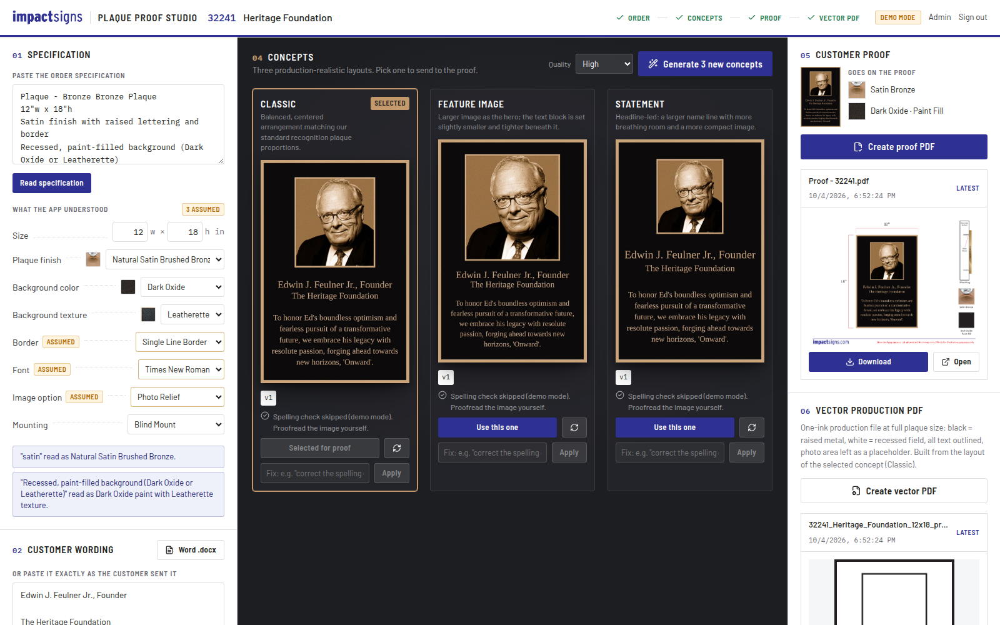

# Plaque Proof Studio

Impact Signs' internal tool for cast bronze plaques. It takes an order and produces:

1. **Three concept images** of the finished plaque, generated with OpenAI's image model (`gpt-image-2.5-sunburst-2026-09-08`). Each uses a different production-realistic layout.
2. **The customer proof PDF** on the locked Impact Signs proof template (the Liquid Mercury layout). It shows the chosen image, red dimension brackets, the finish and paint-fill icons from the asset library, the mounting diagram, the impactsigns.com wordmark and the red disclaimer.
3. **The vector production PDF**, built like `production_32241.ai`: plaque-size page, one ink (black = raised metal, white = recessed field), all text as outlines, no images, and an empty placeholder window for the photo.



---

## How a designer uses it

1. **Sign in** with your name and the team password.
2. **New plaque job:** enter the job number (e.g. `32241`) and a short name.
3. **01 Specification:** paste the order spec exactly as written and click **Read specification**. The app fills in a spec sheet from the catalog. Anything the order didn't state gets an amber **Assumed** tag; check those and change any dropdown if needed.
4. **02 Customer wording:** upload the customer's Word .docx or paste the text. The text is kept character for character. Each line gets a role (headline, subhead, body, footer), which you can change.
5. **03 Customer files:** add the photo, logo (SVG or PDF/AI preferred) and any hand-drawn sketch. The app warns if the photo is low resolution for its size on the plaque.
6. **04 Concepts:** click **Generate 3 concepts**. Images stream in as they render (about a minute). Under each image you can:
   - **Use this one** to pick it for the proof.
   - **Regenerate** (↻) the same layout for a fresh take.
   - **Fix** with a short instruction (e.g. *"correct the spelling of Feulner"*, *"make the border thinner"*). Only that change is made, and the result is saved as a new version (v2, v3…).

   Every image is automatically **spell-checked**: the app reads the text back and compares it with the customer's wording.
7. **05 Customer proof:** click **Create proof PDF**. If the spell check found a difference, the app stops and shows it. Fix the image first, or confirm you've checked it.
8. **06 Vector production PDF:** click **Create vector PDF**. A preflight checklist confirms page size, no fonts, no images and one ink, and warns about stand-in fonts, traced logos and minimum letter heights. Download it and open it in Illustrator (it opens directly, like the .ai files).

Nothing is ever overwritten: every image, proof and production file is kept as its own version.

---

## Deploying on Render.com (one time, about 10 minutes)

1. Merge this branch into `main` on GitHub (or note the branch name to use).
2. Sign in to [render.com](https://render.com) with GitHub, then **New → Blueprint** and pick this repository. Render reads `render.yaml` and sets everything up: the web service, a 5 GB disk for jobs, and all settings.
3. Render asks for two secret values:
   - `OPENAI_API_KEY`: your OpenAI API key. **Create a fresh key** at platform.openai.com → API keys, because the one shared in chat should be treated as exposed. Revoke the old one there.
   - `APP_PASSWORD`: the password your team will type to sign in.
4. Click **Apply**. The first build takes about 5 minutes. Your app is then live at `https://plaque-proof-studio.onrender.com` (or similar).
5. Sign in, open **Admin → System** and click **Check the OpenAI connection**. It should say *Model available*.

The plan in `render.yaml` is Render's "Starter" web service plus a 5 GB disk (about $7–9/month). Every push to the deployed branch redeploys automatically.

**No webhook is needed.** The app calls OpenAI and receives each image in the same request, streaming progress to the screen.

---

## Settings (Render → your service → Environment)

| Setting | Default | What it does |
|---|---|---|
| `OPENAI_API_KEY` | (none) | OpenAI key. Required for real images. |
| `APP_PASSWORD` | (none) | Team sign-in password. If empty, anyone with the link can use the app. |
| `SESSION_SECRET` | generated | Signs login cookies. Render generates it. |
| `OPENAI_IMAGE_MODEL` | `gpt-image-2.5-sunburst-2026-09-08` | Image model. |
| `OPENAI_VISION_MODEL` | `gpt-5.4-mini` | Model that reads the text back for the spell check. |
| `IMAGE_QUALITY` | `high` | Default quality (`low`, `medium`, `high`, `xhigh`, `max`). Designers can also pick Draft / High / Extra high per run. |
| `IMAGE_LONG_EDGE` | `1536` | Longest side of generated images, in pixels. |
| `MOCK_AI` | `0` | `1` = demo mode: simulated images, no OpenAI calls, no cost. |
| `MAX_IMAGE_CALLS_PER_PROJECT` | `40` | Safety cap on images per job. |
| `DAILY_BUDGET_USD` | `40` | Generation stops for the day once estimated spend reaches this. |
| `PRICE_TEXT_IN` / `PRICE_IMAGE_IN` / `PRICE_IMAGE_OUT` | `5` / `8` / `30` | USD per million tokens, used for the cost estimates and the budget. |
| `DATA_DIR` | `/var/data` on Render | Where jobs, images and PDFs are stored (the persistent disk). |

---

## The folders you maintain

| Folder | What goes in it |
|---|---|
| [`assets/`](assets/README.md) | The **static icon library**: finishes, paint colors, textures, borders and image-type examples. Proof icons are pulled from here, never generated. The README lists the exact file names. **Admin → Asset Library** shows what's present. |
| [`brand-assets/`](brand-assets/README.md) | Logo and licensed font files (Myriad Pro for proof labels; Times / Garamond / Minion / Franklin / Helvetica for plaque text). |
| [`references/`](references/README.md) | Real example jobs (spec, wording, photo, final proof, production file). Used to measure the templates and in the automated tests. |
| [`data/catalog.json`](data/catalog.json) | Every option the app offers (finishes and their upcharges, colors, textures, borders, fonts, image types, mountings, size limits) and which icon each uses. To add an option, add it here and drop its icon into `assets/`. |
| [`server/prompts/`](server/prompts) | The instructions sent to the image model with every request. Edit them to tune the look; the version is recorded on every image. Shown read-only in **Admin → Image prompts**. |

---

## How the AI is kept honest (the "prompting" problem)

The image API has no saved "system prompt": every request carries everything. Each concept request sends:

- **Reference 1, the exact layout drawing.** The app draws the plaque flat with code: true size and proportions, real typeface, every line of wording in place, the customer photo in its frame. The model is told to keep every position and letter and only make it look like real cast metal. This one drawing is what keeps the AI from inventing layouts or rewording text, and it is also why the vector PDF matches the chosen concept.
- **Real reference photos from `assets/`:** the chosen image-type example (bas relief vs photo relief vs etched vs UV print), the finish swatch, paint swatch, texture, border example, plus the customer's photo, logo and sketch.
- **The house rules** (`server/prompts/house_rules.md`): one real plaque, straight-on, filling the frame edge to edge, raised metal vs recessed painted field, nothing added.
- **The job details**, built from the catalog's descriptions of each option.

After generation, the app crops the image to the plaque's exact proportions (so the proof brackets line up) and spell-checks it.

---

## Running it on a computer (developers)

```bash
npm install
cp .env.example .env        # then fill in OPENAI_API_KEY and APP_PASSWORD (or set MOCK_AI=1)
npm run build && npm start  # http://localhost:8080
# or, while editing code:  npm run dev   (web on :5173, API on :8080)
```

- `npm test` runs the golden tests: the Heritage Foundation job must reproduce the real proof and production file within 2 pt, the production PDF must pass preflight, and more.
- `npm run samples` writes sample proof and production files to [`output/samples/`](output/samples).
- `node scripts/screens.mjs` captures screenshots into `docs/screens/` (needs a running server).
- `python3 scripts/build_proof_template.py` rebuilds the static proof template from the real proof, if the proof design ever changes.

Optional system tool: **Poppler** (`pdftocairo`), installed automatically in the Docker image. It reads PDF/.ai uploads and renders proof previews.

See [`docs/DECISIONS.md`](docs/DECISIONS.md) for design decisions and what is still unverified.
