# Sample outputs

Each example job from `references/`, built by the app in its proof style (left) next to the real Impact Signs proof (right). The plaque on our proofs is the code-drawn layout drawing; in the app it is the AI concept you pick.

## 31547 · Forest Preserve District of Kane County

36" x 24" bronze donor plaque: ruled section headings and 3- and 4-column name lists. Standard proof

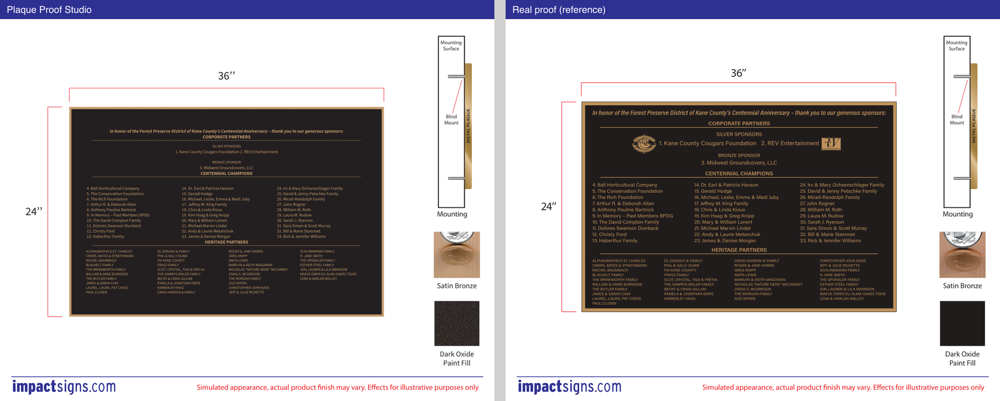

Proof: [31547-standard-proof.pdf](31547-standard-proof.pdf) · Vector production file: [31547_Forest_Preserve_District_of_Kane_36x24_production.pdf](31547_Forest_Preserve_District_of_Kane_36x24_production.pdf) · Preflight: passed

## 31882 · Honeywell (Jacob Sarfati)

8" x 12" brushed aluminum garden-stake memorial with photo between the lines. Standard proof with a red note

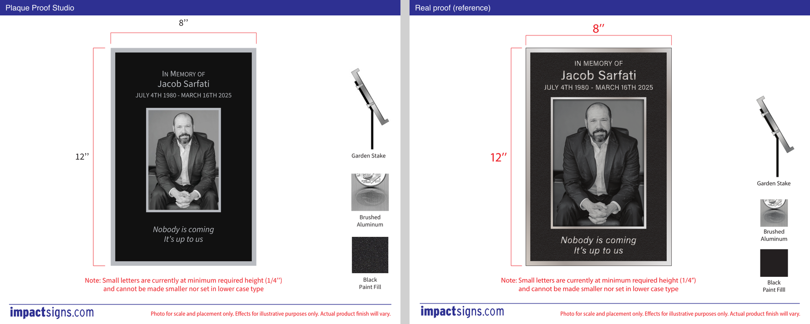

Proof: [31882-standard-proof.pdf](31882-standard-proof.pdf) · Vector production file: [31882_Honeywell_Jacob_Sarfati_8x12_production.pdf](31882_Honeywell_Jacob_Sarfati_8x12_production.pdf) · Preflight: passed

## 32054 · City of Arroyo Grande

6" x 2" bronze, two lines of capitals. Standard proof

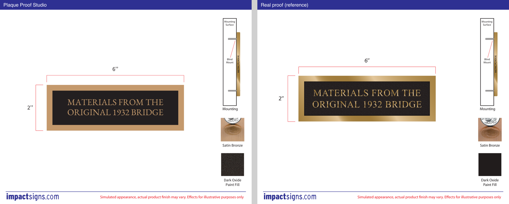

Proof: [32054-standard-proof.pdf](32054-standard-proof.pdf) · Vector production file: [32054_City_of_Arroyo_Grande_6x2_production.pdf](32054_City_of_Arroyo_Grande_6x2_production.pdf) · Preflight: passed

## 32240 · Friends of Sax-Zim Bog

8" x 5" bronze, four countersunk face screws, custom font (Clarendon Fortune Bold). Description sheet without scale figure

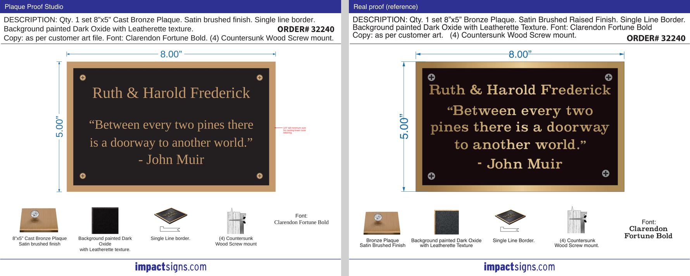

Proof: [32240-description-proof.pdf](32240-description-proof.pdf) · Vector production file: [32240_Friends_of_Sax_Zim_Bog_8x5_production.pdf](32240_Friends_of_Sax_Zim_Bog_8x5_production.pdf) · Preflight: passed

## 32241 · Heritage Foundation

12" x 18" bronze, photo relief portrait, blind mount. Standard proof (Liquid Mercury)

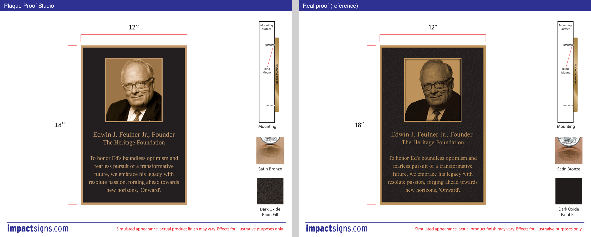

Proof: [32241-standard-proof.pdf](32241-standard-proof.pdf) · Vector production file: [32241_Heritage_Foundation_12x18_production.pdf](32241_Heritage_Foundation_12x18_production.pdf) · Preflight: passed

## 32249 · City of Santa Barbara – Structure of Merit

7" x 5" reverse-etched bronze, double border, smooth black fill. Order/version proof with outline-art page

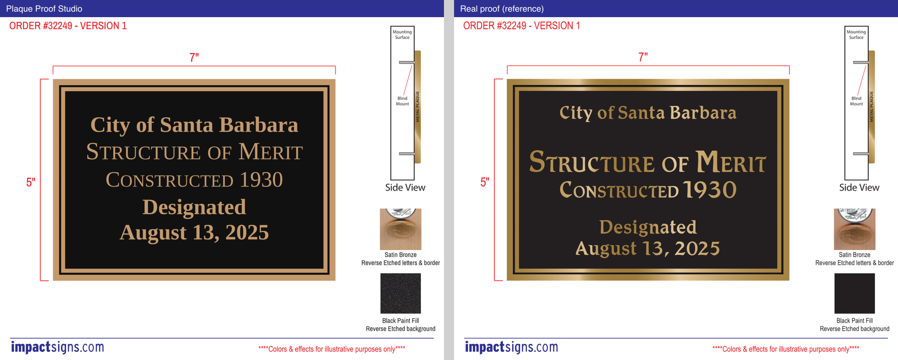

Proof: [32249-etched-proof.pdf](32249-etched-proof.pdf) · Vector production file: [32249_City_of_Santa_Barbara_Structure__7x5_production.pdf](32249_City_of_Santa_Barbara_Structure__7x5_production.pdf) · Preflight: passed

## 32408 · Hadar Family Hall

42" x 36" bronze, double border, custom paint (Dark Blue 2050). Description sheet with site photo. Note: the order text says 36"x42 but the plaque is 42" wide

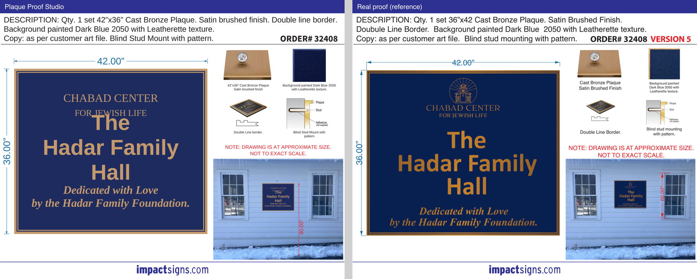

Proof: [32408-description-proof.pdf](32408-description-proof.pdf) · Vector production file: [32408_Hadar_Family_Hall_42x36_production.pdf](32408_Hadar_Family_Hall_42x36_production.pdf) · Preflight: passed

## 32582 · Kathleen Awe memorial

6" x 4" bronze garden-stake memorial, text only. Description-sheet proof

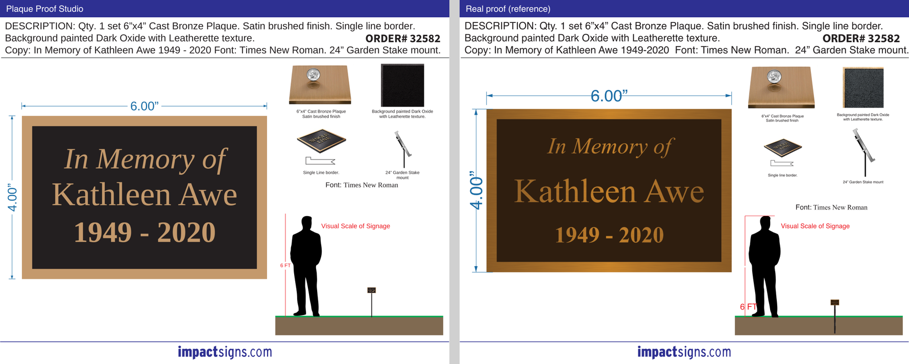

Proof: [32582-description-proof.pdf](32582-description-proof.pdf) · Vector production file: [32582_Kathleen_Awe_memorial_6x4_production.pdf](32582_Kathleen_Awe_memorial_6x4_production.pdf) · Preflight: passed

## 32717 · Camp Southern Ground (Mike Dobbs)

12" x 16" bronze, double-line border, photo relief portrait. Standard proof

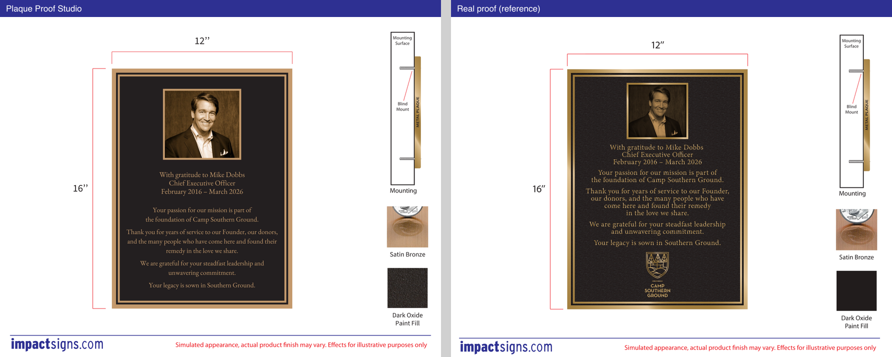

Proof: [32717-standard-proof.pdf](32717-standard-proof.pdf) · Vector production file: [32717_Camp_Southern_Ground_Mike_Dobbs_12x16_production.pdf](32717_Camp_Southern_Ground_Mike_Dobbs_12x16_production.pdf) · Preflight: passed

## 32782 · Audubon (Eleanor Eisenmenger)

8" x 6" bronze garden-stake plaque, brown paint, sans type. Standard proof with garden-stake diagram

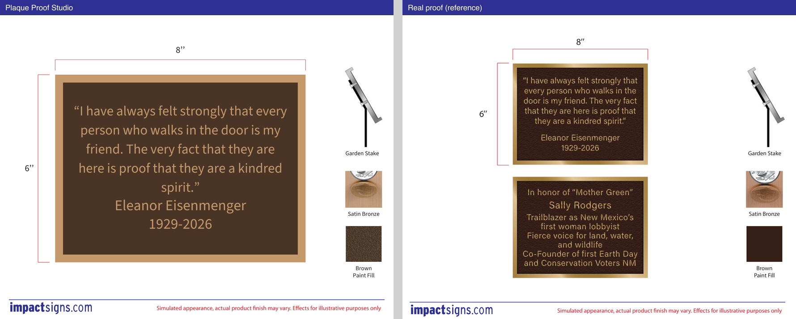

Proof: [32782-standard-proof.pdf](32782-standard-proof.pdf) · Vector production file: [32782_Audubon_Eleanor_Eisenmenger_8x6_production.pdf](32782_Audubon_Eleanor_Eisenmenger_8x6_production.pdf) · Preflight: passed

## 32885 · Raccoon River Pet Rescue

18" x 24" bronze with full-color UV photo between text blocks. Description-sheet proof with wall scale

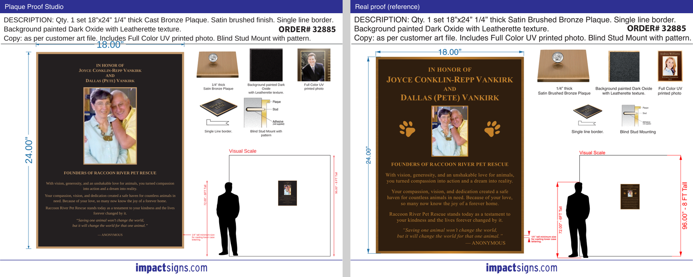

Proof: [32885-description-proof.pdf](32885-description-proof.pdf) · Vector production file: [32885_Raccoon_River_Pet_Rescue_18x24_production.pdf](32885_Raccoon_River_Pet_Rescue_18x24_production.pdf) · Preflight: passed
